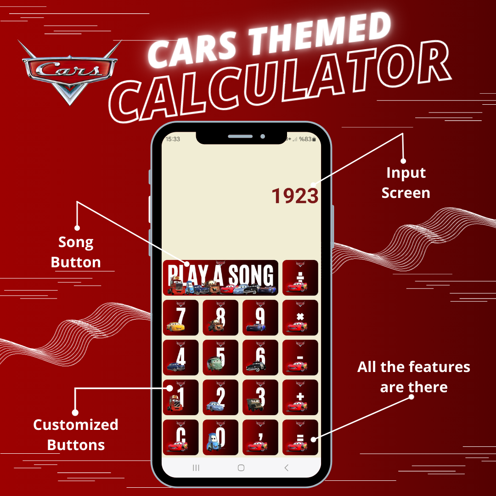

# Cars Themed Calculator App


This project is **Beginner-Friendly**

I used:
- **StyleSheet**
- **SafeAreaView**
- **TextInput**
- **View**
- **Image**
- **TouchableOpacity**
- **Linking** commands.

And **a lot of functions...**

### 1- Input Screen

* A screen where the user can see the transactions.


### 2- Customized Buttons
* All buttons have a uniq style.


## Running the project

### Install Expo :
https://docs.expo.dev/get-started/installation

### When installation is complete, Download Expo Go to your phone :
(So you can try it on your phone)

https://docs.expo.dev/get-started/expo-go

### Finally clone this repository :

```
git clone https://github.com/Emirucgun/calculator.git
cd calculator
```


## Last words from me:

**I have worked hard to create this project and I hope you enjoy it. The purpose of creating this project is to make sure that others have fun with it and learn from it.**

**Use the project as you want. Don't be afraid to change it, add to it, or do something completely different.**

**If you have any questions or feedback about the project, please let me know.**

**Have a good day!**


